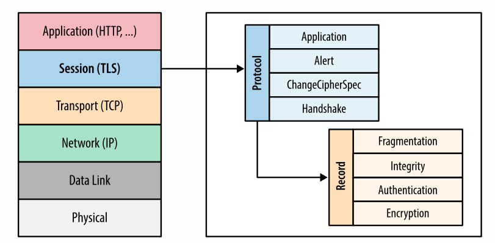
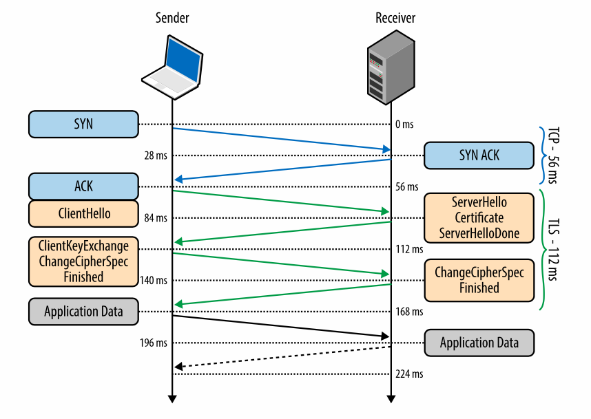
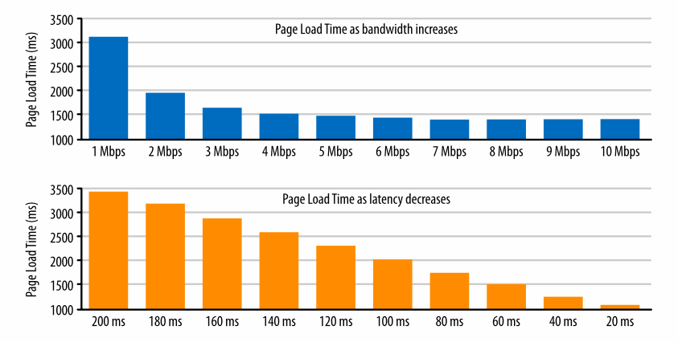

## High Performance Browser Networking

By Ilya Grigorik

### Chapter 1: Primer on Latency and Bandwidth

#### Speed is a Feature

- Latency is the time elapsed between a source sending a packet and the destination receiving it.
- Bandwidth is the maximum throughput of a communication path.


#### The Many Components of Latency

- Latency is the sum total of a few different kinds of delays:

  1. Propagation Delay - function of distance & medium of propagation between source and destination
  2. Transmission Delay - function of the packet's length and data transfer rates
  3. Processing Delay - time required to process packet headers, check for bit-level errors etc.
  4. Queuing Delay - amount of time packets stay in queue

- Network data rates are typically measured in bits per second (bps), whereas data rates for non-network equipment are typically shown in bytes per second (Bps).

- It's 30 mega-bits-per-second and not 30 mega-bytes-per-second. This is why ISP speeds usually need to be divided by 8 (1 Byte = 8 bits) to find out the true speed of the internet connection.

- Serving content from a nearby location to the client enables us to significantly reduce the propagation time of all the data packets. This is why CDNs exist. They allow us to upload content once and they distribute it across various servers around the globe in order to reduce propagation delay for the user when the content is requested.

#### Last-Mile Latency

- Last-Mile latency is ironically the biggest contributor to increasing latency rather than crossing oceans or continents.

- To connect our home or office to the Internet, the local ISP needs to route the cables throughout the neighbourhood, aggregate the signal, and forward it to a local routing node. All this in practice can alone take ~10 ms of work.

- Optical fibers have a distinct advantage when it comes to bandwidth because each fiber can carry many different wavelengths (channels) of light through a process known as wavelength-division multiplexing (WDM).

#### Bandwidth at the Network Edge

- The backbones or the fiber links form the core data paths of the Internet. But the strength of the network actually depends on the technology deployed (dial-up, DSL etc.) at the edges ie. connection to our homes. The available bandwidth to the user is a function of the lowest capacity link between the client and the destination server.

#### Delivering Higher Bandwidth and Lower Latencies

- The ideal condition for "fast internet" is higher bandwidths and lower latencies.

- Achieving higher bandwidths is a relatively easy task – we can add more fiber links, improve WDM techniques.

- Lowering latency is a much harder challenge. This is mainly because there is simply no way around the laws of physics: the speed of light places a hard limit on minimum latency. Alternatively, since we can’t make light travel faster, we can make the distance shorter but that has it's own challenges imposed by the physical terrain, social and political reasons.

### Chapter 2: Building Blocks of TCP

```plaintext
Big Takeaway

TCP handshake, Flow control, Slow-start, Congestion Avoidance

```

- At the heart of the Internet are two protocols: IP and TCP.

- The IP, or Internet Protocol provides the host-to-host routing and addressing.

- TCP, or Transmission Control Protocol is a _transport_ protocol that provides the _abstraction_ of a reliable network running over an unreliable channel, hiding most of the complexity of network communication from our applications: retransmission of lost data, in-order delivery, congestion control and avoidance, data integrity, and more.

- The HTTP standard does not mandate TCP as the only transport protocol. A different protocol such as UDP can also be used with HTTP but due to the many great and convenient features TCP provides out of the box, all HTTP traffic on the Internet today is delivered via TCP. This is what makes understanding TCP important from a web optimisation standpoint.

- The reason we've heard of IPv4 and not IPv{1,2,3} is because before IPv4, IP and TCP were not separate entities. It was only in 1981 that the two protocols were separated.

#### Three Way Handshake

- All TCP connections begin with a three-way handshake. No application data can be exchanged between client and server before this handshake is done. The handshake's three phases are called `SYN`, `SYN ACK` and `ACK`.


- The delay imposed by the three-way handshake makes new TCP connections expensive to create, and is one of the big reasons why connection reuse is a critical optimisation for any application running over TCP.

#### Congestion Avoidance and Control

- Congestion Collapse is a recognised problem in complex networks. It occurs in a situation with asymmetric bandwidth capacity between network nodes. Congestion Collapse is a stable condition wherein if the algorithm for selecting packets to be dropped is fair, the network continues to operate, just in a degraded condition.

- To address the issue of Congestion Collapse, TCP has multiple mechanisms in place: flow control, congestion control (slow start), and congestion avoidance.

#### Flow Control

- Flow control is a mechanism to prevent the sender from overwhelming the receiver with data it may not be able to process – the receiver may be busy, under heavy load, or may only be willing to allocate a fixed amount of buffer space. To address this, each side of the TCP connection advertises its own `receive window (rwnd)`, which communicates the size of the available buffer space to hold the incoming data.

- While Flow Control helps manage congestion on the receiver's end, there are still measures needed to prevent either side from overwhelming the underlying network – Slow Start and Congestion Avoidance help here.

#### Slow Start

- Since neither the sender nor the receiver know the available bandwidth at the beginning of a new connection Slow Start and Congestion Avoidance help in estimating and adapting speeds to the continuously changing conditions within the network.

- TCP slow start is an algorithm which balances the speed of a network connection. Slow start gradually increases the amount of data transmitted until it finds the network’s maximum carrying capacity.

- Fetching a file over a new TCP connection (handshake + slow start)


#### Congestion Avoidance

- TCP as a system is designed to use packet loss as a feedback mechanism to help regulate its performance.

- Slow-start initialises a connection with a conservative window and, for every roundtrip, doubles the amount of data in flight until it exceeds the receiver’s flow-control window, a system-configured congestion threshold (ssthresh) window, or until a packet is lost. At this point the congestion avoidance algorithm takes over.

- In congestion avoidance, instead of exponentially increasing the speed on the network, the algorithm increases by speeds by 1 unit on each ACK. This is done until more packets are lost which then repeats the process of congestion avoidance (or control, depending on the size of the congestion window).

#### Bandwidth-Delay Product

- The maximum amount of unacknowledged data that can be in flight at any point in time. Product of data link’s capacity and its end-to-end delay.

- **Bandwidth plays a much less crucial role in a TCP system. It is factors like the three-way handshake, slow start and most importantly latency that are the main bottlenecks**

#### Head-of-Line Blocking

- While TCP is a popular choice for most situations, it is not necessarily the best choice for every occasion. Some of its features, such as in-order and reliable packet delivery, are not always necessary and can introduce unnecessary delays and negative performance implications. One such negative implication is Head-of-Line blocking.

- Every TCP packet carries a unique sequence number when put on the wire, and the data must be passed to the receiver in-order. If one of the packets is lost en route to the receiver, then all subsequent packets must be held in the receiver’s TCP buffer until the lost packet is retransmitted and arrives at the receiver. Because this work is done within the TCP layer, our application has no visibility into the TCP retransmissions or the queued packet buffers, and must wait for the full sequence before it is able to access the data. Instead, it simply sees a delivery delay when it tries to read the data from the socket. This effect is known as TCP head-of-line (HOL) blocking.

- The delay imposed by head-of-line blocking allows our applications to avoid having to deal with packet reordering and reassembly, which makes our application code much simpler. However, this is done at the cost of introducing unpredictable latency variation in the packet arrival times, commonly referred to as _jitter_, which can negatively impact the performance of the application.

#### Tuning Application Behaviour

- Tuning performance of TCP allows the server and client to deliver the best throughput and latency for an individual connection. However, how an application uses each new, or established, TCP connection can have an even greater impact:

  1. No bit is faster than one that is not sent; send fewer bits.
  2. We can’t make the bits travel faster, but we can move the bits closer.
  3. TCP connection reuse is critical to improve performance.

### Chapter 3: Building Blocks of UDP

- `UDP` came into picture much after `TCP/IP`, around the time when `TCP` and `IP` were being separated.

- The primary feature of `UDP` is not what _more_ it brings to the table, but what it chooses to omit.

- `UDP` is also known as the _null protocol_.

- The term `packet` applies to any formatted block of data, while the term `datagram` is often reserved for packets delivered via an unreliable service – no delivery guarantees, no failure notifications.

- `UDP` originally stands for User Datagram Protocol but due to its unreliable nature, it's frequently also called Unreliable Datagram Protocol.

- `DNS` or Domain Name System is an application of `UDP`.

#### Null Protocol Services

- The `IP` networking layer has the primary task of delivering datagrams from the source to the destination host based on their addresses. To do so, the messages are encapsulated within an IP packet which identifies the source and the destination addresses, as well as a number of other routing parameters.

- `UDP` simply provides a layer of abstraction on top of `IP` by embedding the source and the target application ports of the communicating hosts.

- `UDP`'s non-services (things it omits):

  1. No guarantee of message delivery
  2. No guarantee of order of delivery
  3. No connection state tracking
  4. No congestion control

- `TCP` is a byte-stream oriented protocol capable of transmitting application messages spread across multiple packets without any explicit message boundaries within the packets themselves. `UDP` datagrams, on the other hand, have definitive boundaries: each datagram is carried in a single IP packet, and each application read yields the full message; datagrams cannot be fragmented.

#### UDP and Network Address Translators

- `IPv4` addresses are only 32 bits long, they provide a maximum of 4.29 billion unique IP addresses. While this is a big number on the surface, it isn't large enough to keep up with everyone trying to connect to the Internet. To solve this address depletion issue, the IP `Network Address Translator (NAT)` specification was introduced as an (interim) solution.

- Each `NAT` is responsible for maintaining a table mapping of local IP and port tuples to one or more globally unique (public) IP and port tuples. The local IP address space behind the translator can then be reused among many different networks, thus solving the address depletion problem.

- A big challenge with `UDP` is establishing connection, this is especially true for P2P applications, such as VoIP, games, and file sharing. The reason for this challenge is primarily the presence of `NAT`s and how difficult it can be to traverse them.

- NAT Traversal is the process of providing the _right_ (public IP that is actually part of the `NAT`'s translation table) information to a `NAT` so it can route you correctly.

- Popular NAT traversal techniques include `STUN`, `TURN` and `ICE`.

- `STUN` or Session Traversal Utilities for NAT is a protocol where the client sends a request to a `STUN` server on the public network to find out its public IP address and port as seen from the public network. The downside for this protocol is that it is not sufficient to deal with all `NAT` topologies and network configurations. In some cases, `UDP` may be blocked altogether by a firewall or some other network appliance.

- `TURN` or Traversal Using Relays around NAT is a protocol where the client sends a request to a public "relay" server which helps connect to the server. The obvious downside in this exchange is that it is no longer peer-to-peer! `TURN` also has a very high cost of operating.

- `ICE` or Interactive Connectivity Establishment is a protocol, and a set of methods that seek to establish the most efficient tunnel between the participants - direct connection where possible, leveraging `STUN` negotiation where needed, and finally fallback to `TURN` if all else fails.

### Chapter 4: Transport Layer Security (TLS)

- `SSL` was a protocol developed by `Netscape` to ensure safety of user's data for e-commerce platforms on the web. It was a protocol built on top of `TCP` within the application layer of the Network stack.



- The `SSL` protocol was standardised by the `IETF`, it was renamed to `Transport Layer Security (TLS)`.

- `TLS` is designed to provide three essential services to all applications running above it: encryption, authentication, and data integrity.

- In order to establish a cryptographically secure data channel, the connection peers partake in a `TSL` handshake.



- During the `TLS` handshake:

  1. Encryption comes as a result of using cryptography (`RSA` or `Diffie-Hellman`)
  2. Authentication is guaranteed based on a chain of trust among clients and servers (more about this below)
  3. Integrity is ensured using a checksum-like technique

- TLS connections require two roundtrips for a "full handshake" which is bad thing. In practice, optimised deployments can do much better and deliver a consistent 1-RTT TLS handshake. This is achieved using two techniques:

  1. `False Start`: TLS protocol extension that allows the client and server to start transmitting encrypted application data when the handshake is only partially complete
  2. If the client has previously communicated with the server, an "abbreviated handshake" can be used

- RSA, Diffie-Hellman and Forward Secrecy:

  - [Diffie-Hellman](https://www.youtube.com/watch?v=NmM9HA2MQGI)
  - [Issues with RSA & Forward Secrecy](https://www.youtube.com/watch?v=vsXMMT2CqqE)

- The popularity of `HTTP` has created a vibrant ecosystem of various proxies and intermediaries on the Web: cache servers, content filters etc. and as a result _secure_ communication over `HTTP` is really difficult. This is why `HTTPS` is slowly becoming a requirement everywhere. `HTTPS` provides a secure tunnel for connection peers to talk over.

- `Session Identifiers` are one way to perform an abbreviated `TLS` handshake. In this mechanism, clients can send a session ID to a server they have talked to in the past to re-establish a connection in 1-RTT. The practical limitation of this mechanism is the requirement for the server to create and maintain a session cache for every client.

- `Sessions Tickets` are another way to perform an abbreviated `TLS` handshake. In this approach, the server sends a session ticket to the client protected by its private key which the client can decrypt and use to establish a connection with the server for subsequent connections. Thus, all session data is stored only on the client, but the ticket is still safe because it is encrypted with a key known only by the server.

- Authentication on the Web follows the principle of a `Chain of Trust`. If Alice, Bob and Charlie are three friends then their chain of trust would look something like this: Alice trusts Bob, Bob trusts Charlie, and by transitive trust, Alice decides to trust Charlie. As long as nobody in the chain is compromised, the chain is allowed to build and grow its list of trusted parties.

- In practice, browsers establish a chain of trust with Certificate Authorities (CA). A CA is a trusted third party that is trusted by both the subject (owner) of the certificate and the party relying upon the certificate.

- Our browsers specify which CAs to trust (root CAs), and the burden is then on the CAs to verify each site they sign, and to audit and verify that these certificates are not misused or compromised. If the security of any site with the CA’s certificate is breached, then it is also the responsibility of that CA to revoke the compromised certificate.

### Chapter 5: Introduction to Wireless Networks

```plaintext
Big Takeaway:

The performance of _any_ wireless network is fundamentally
limited by one, the amount of allocated bandwidth and two,
the signal-to-noise ratio between receiver and sender.

```

- Types of Wireless Networks: `PAN` (Bluetooth, NFC), `LAN` (WiFi), `MAN` (WiMAX), `WAN` (LTE)

- Our next application may be delivered over a mobile network, but it may also rely on NFC for payments, Bluetooth for P2P communication via WebRTC, and WiFi for HD streaming. Clearly, we should not be picking, or betting on, just one wireless standard!

- Channel capacity of a wireless network is its maximum information rate.

- The performance of _any_ wireless network is fundamentally limited by one, the amount of allocated bandwidth and two, the signal-to-noise ratio between receiver and sender.

- All radio-powered communication is:

  - Done over a shared communication medium (radio waves)
  - Regulated (by the govt.) to use specific bandwidth frequency ranges
  - Regulated (by the govt.) to use specific transmit power rates
  - Subject to continuously changing background noise and interference
  - Subject to technical constraints of the chosen wireless technology
  - Subject to constraints of the device: form factor, power, etc.

### Chapter 6: WiFi

- `WiFi` is trivial to deploy by anyone, anywhere; and the required hardware for it is simple and cheap.

- Most `Ethernet` and `WiFi` protocols schedule all communication ie. they treat the shared medium, regardless of whether it is a wire or the radio waves, as a "random access channel". This means that there is no central process, or scheduler, that controls who or which device is allowed to transmit data at any point in time. Instead, each device decides on its own.

- Communication scheduling happens using two important protocols: `CSMA` and `CSMA/CD`.

  - `CSMA` is a "listen before you speak" algorithm which checks whether anyone else is transmitting and if the channel is free, it transmits the data, else it listens until free.

  - `CSMA/CD` is a collision detection algorithm. If a collision is detected, both parties stop transmitting immediately and sleep for a random interval (with exponential backoff).

- `WiFi` specifically using a collision avoidance algorithm (`CSMA/CA`) rather than `CSMA/CD`. Here, each sender attempts to avoid collisions by transmitting only when the channel is sensed to be idle.

- Based on some probabilistic math, channel load below 10% to get good channel utilisation (minimise number of collisions).

- "b", "g" `WiFi` standards utilise 2.4GHz bands while "n" and "ac" standard utilise 5GHz bands.

- Since `WiFi` does not provide any bandwidth or latency guarantees, our application must be vary of the connection it is working over. An example of this in practice can be seen in Adaptive Bitrate Streaming.

### Chapter 10: Primer on Web Performance

- Historically, Page-Load-Time has been the de facto way to measure web performance. But, it's too simplistic a metric to evalute modern web applications.

- Presently, the success of a performance and optimization strategy is directly correlated to the ability to define and iterate on application-specific benchmarks and criteria. Nothing beats application-specific knowledge and measurements, especially when linked to bottom-line goals and metrics of your business.

- Majority of time while loading web applications is spent in DNS resolution, TCP connection handshake, TLS negotiation (if required) etc. and not on the content download portion of a request.

- More bandwidth doesn't matter, _much_. Access to higher bandwidth data rates is always good, especially for cases that involve bulk data transfers: video and audio streaming. However, when it comes to everyday web browsing, which requires fetching hundreds of relatively small resources from dozens of different hosts, roundtrip latency is the limiting factor.



- Tools like the Network, User and Resource Timing APIs can be very helpful in doing Real-User performance testing for applications. These APIs are exposed by most modern browsers.

- A modern web browser is much more than a simple network socket manager. It does a lot of web optimisation out of the box:

  - Resource pre-fetching and prioritization
  - DNS pre-resolve
  - TCP pre-connect
  - Page pre-rendering

#### Chapter 11: HTTP/1.X

- Improving performance of HTTP was one the key design goals for the `HTTP/1.1`.

- The entire web optimisation game is about reducing RTTs which in turn speed up load times.

- `HTTP/1.1` offers various strategies for optimization:

  - `Keep-Alive` Header - helps keep a TCP connection alive till explictly told to turn off by the use of another header
  - `HTTP Pipelining` - allows requests to be sent in parallel to the server. eg. requesting an `HTML` and `CSS` file together. The downside is that servers in `HTTP/1.1` don't support multiplexing (sending responses in parallel) due to the strict order of delivery imposition. As a result, `HTTP Pipelining` adoption has remained low.
  - Browsers are capable of creating multiple TCP connections (6 at most). This in a way is like multiplexing but it doesn't reach the same levels of performance as it.
  - `Domain Sharding` is a technique where we can manually split a website's resources across a lot of subdomains or "shards" and then request for them via the browsers. This enforces the browser to use multiple TCP connections in turn making loads faster. Although effective in moderation, `Domain Sharding` is overused and that causes tens of underutilized TCP streams, many of them never escaping TCP slow-start.
  - There are instances where request and response header sizes exceed the size of the resource being fetched. Such situations should be avoided.
  - Resource `Concatenation` is a technique where multiple `JS` and `CSS` files are combined to form `JS` and `CSS` bundles which are then fetched by websites. This helps reduce multiple requests to the server. The downside to this is that even small changes in the `JS` and `CSS` for a website requires a re-fetch of these bundles files.
  - Image `Spriting` is another way to cut down on multiple requests to a server. In this technique, images on a website are combined to form a large sprite sheet. The spirte sheet is fetched by the website and then displayed by chopping up using additional application-level CSS.
  - `Resource inlining` is a technique which allows us to inline small assets into our `HTML`. This is usually done for static resources ie. images that won't change frequently. This is an effective technique when we have images to display that are so small (1-2 KB) that fetching them over `HTTP` would be detrimental to performance.

```HTML
<!-- Resource Inlining -->

```

- Finding the right balance among all of these optimizations is an imperfect science.
