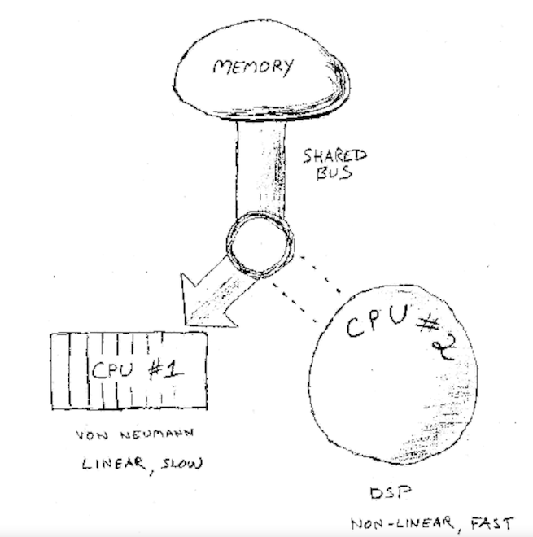

## Pragmatic Thinking and Learning

By Andy Hunt

### Recipes

1. Always consider the context
2. Use rules for novices, intuition for experts.
3. Know what you don't know.
4. Learn by watching and imitating.
5. Keep practicing in order to remain expert.
6. Avoid formal methods if you need creativity, intuition, or inventiveness.
7. Learn the skill of learning.
8. Capture all ideas to get more of them.
9. Learn by synthesis as well as by analysis (ie. Learn by doing).
10. Strive for good design; it really works better.
11. Rewire your brain with belief and constant practice.
12. Add sensory experience to engage more of your brain.
13. Lead with R-mode; follow with L-mode.
14. Use metaphor as the meeting place between L-mode and R-mode.
15. Cultivate humor to build stronger metaphors.
16. Step away from the keyboard to solve hard problems.
17. Change your viewpoint to solve the problem.

### Chapter 1: Introduction

- The essence of _pragmatism_ is to do what works — for you.
- Everything is interconnected: the physical world, social systems, your innermost thoughts, the unrelenting logic of the computer—everything forms one immense, interconnected system of reality. Nothing exists in isolation; everything is part of the system and part of a larger context.
- Small things having unexpectedly large effects is the hallmark of nonlinear systems.
- Systems thinking is a way to look at the world in which one tries to envision an object as a connection point of several systems, rather than as a discrete object unto itself. _Everything is interconnected_.

### Chapter 2: Journey from Novice to Expert

#### Introduction

- `Event theories` are a category of theories that can be measured; these types of theories can be verified and proven. You can judge the accuracy of an event theory.
- `Construct theories` are another category of theories that are intangible abstractions; you cannot prove them.  Instead, construct theories are evaluated in terms of their usefulness.
- Example of a construct theory: the concept of _Mind_. Mind is an abstraction; there’s really no such thing.  It’s just an idea, a concept.
- Dreyfus's model of skill acquisition is a construct theory.
- There’s more to skill levels than just being better, smarter, or faster. The Dreyfus model describes how and why our abilities, attitudes, capabilities, and perspectives change with skill level.

#### Novices vs Experts

- The novices need clear, context-free rules by which they can operate.
- The experts on the other hand need freedom to think about systems in a context-aware manner. This allows them to use their intuition to solve problems.
- Novices and experts are fundamentally different. They see the world in different ways, and they react in different ways.
- _It's hard to articulate expertise_.

#### The Five Stages of the Dreyfus Model

- Dreyfus is applicable per skill. It’s a situational model and not a trait or talent model.
- The following are the five stages of the Dreyfus model:

1. Novice
    - Novices need recipes.

2. Advanced Beginner
    - Advanced beginners don't want the big picture.

3. Competent
    - Competents can troubleshoot.

4. Proficient
    - Proficient practioners can self-correct.
    - Proficient practitioners need the big picture. They will seek out andwant to understand the larger conceptual framework around this skill. They will be very frustrated by oversimplified information.

5. Expert
    - Experts work from intuition.
    - Although experts can be amazingly intuitive — to the point that it looks like magic to the rest of us — they may be completely inarticulate as to how they arrived at a conclusion. They genuinely don’t know; it just "felt right."

#### Using the Dreyfus Model Effectively

- In order to use the model effectively, we must first:

    1. Help transition `Advanced Beginners` to `Compotents` in order to raise the bar for people and to get them to start accepting responsibility of their actions. A major way to help achieve this is to have good exemplars in the environment since humans learn best by example.
    2. Keep expertise in practice. Rather, keep `Expert`s happy so they can influence the entire team they are a part of. This has a great impact on the entire team in the long-run.

#### Beware the Tool Trap

- Don’t succumb to the false authority of a tool or a model. There is no substitute for thinking.

### Chapter 3: This Is Your Brain

- A useful analogy for the human brain is a dual-CPU, single-master bus design computer system.



- The two CPUs of the brain are:

    1. CPU #1: von Neumann-style CPU for linear, logical thought and language processing. Processes instructions step-by-step, in order. CPU #1 is relatively slow. This linear-processing style of CPU #1 is called _linear_-mode or **L**-mode.

    2. CPU #2: A kind of super regular-expression search engine, responsible for searching and pattern-matching. It can go off "thinking" of something and return back results at a later time asynchronously. CPU #2 style processing is called _rich_-mode or **R**-mode.

- We need both the types of CPUs. **R**-mode is critical for intuition, problem solving, and creativity. **L**-mode gives us the power to work through the details and make it happen.

```plaintext
Extra Note:

CPU #1 is designed with an idle-loop routine as well. If it isn't processing anything,
it simply generates an internal stream of verbal chatter. This is the little voice
in our heads.

```

- Due to the unpredictable nature of R-mode, answers and insights can pop up at any time. As a result, it is always good to be prepared with some method to jot down ideas – all the ideas!

- If we don't keep track of great ideas, we will stop noticing that we have them. The corollory is also true: once we start keeping track of ideas, _we get more of them_.

- There’s no such thing as left brain and right brain; the various lobes of the brain and structures at different levels cooperate in a highly distributed fashion. But despite that cooperation, we still have these two different cognitive styles — CPU #1 and CPU #2.

- Our culture has clear L-mode bias. It is true that L-mode thinking has differentiated humankind from common beasts but it has also caused us to become too reliant of L-mode thinking. We've lost touch with R-mode thinking – the kind of thinking that adds a little bit of intuitive magic in the way we think.

- Neuroplasticity ie. the plastic nature of brains make our brains re-wireable. The maximum amount we can learn, or the number of skills we attain, is not fixed. Just thinking that your brain has more capacity for learning makes it so.

- On the flipside, the brain uses a "Use it or Lose it" policy wherein it dedicates more resources to whatever we do the most. This makes losing skills also a possibility. This is exactly why musicians practice scales incessantly, it's to do a refresh on their dynamic RAM.

### Chapter 4: Get in Your Right Mind

- The simplest thing one can do to involve more of the brain in problem solving and creativity is to activate more neural pathways than ususal ie. expanding sensory involvement.

- An example of involving more senses while problem solving is to fiddle with a paper clip or solve a tactile puzzle.

- Other than involving other senses, another technique is using cross-sensory feedback. Write the problem down, draw a picture, describe it verbally etc.

- Only using R-mode processing isn't the solution to our problem. By itself, R-mode cannot solve problems – it can even process language, after all. Instead the solution is to synchronise L-mode and R-mode processing.

- What we should strive for is an R-mode to L-mode flow. We want R-mode to lead to acquire context, initial knowledge and then we want L-mode to "productize" things and help us get shit done.

- Pair Programming is an excellent way to get the L-mode and R-mode to work together. Thinking in and using metaphors is another such way.

- Two ways to harvest more out of R-mode:

1. Image Streaming
2. Free-form journaling

- R-mode cannot be commanded, it can be invited. We almost have to defocus a bit to invite it. As soon as we become goal-oriented, L-mode sprints back up. Taking a walk in a labyrinth, engaging in mundane tasks like taking a shower are for this very reason a good way to invite R-mode.

- Non-goal-directed playing with an idea to make connections, see relationships, and gain insights is another way to invite R-mode.
